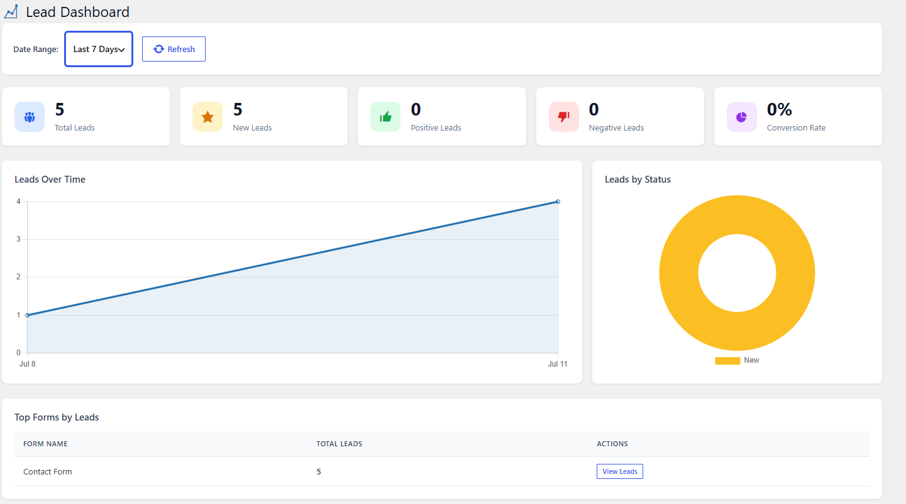
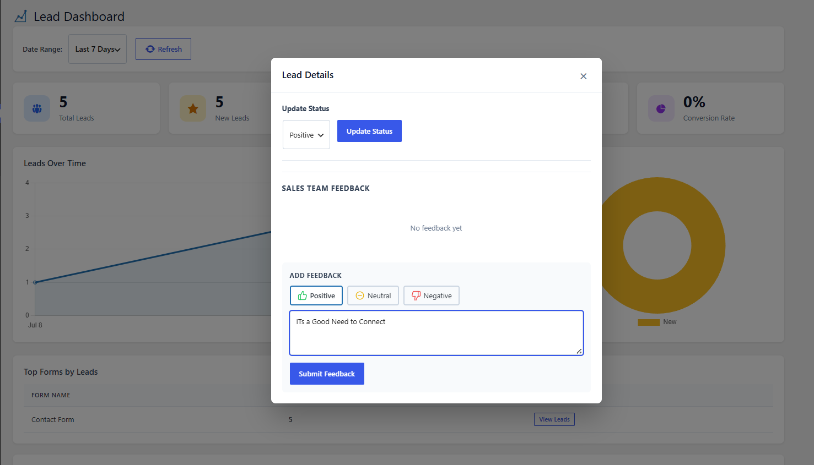

# DevXpert Lead Dashboard for Forminator & Contact Form 7



**Turn your Forminator and Contact Form 7 submissions into trackable leads with a simple sales dashboard, statuses, feedback notes, and CSV export.**

| | |
|---|---|
| **Contributors** | [anupkankale](https://profiles.wordpress.org/anupkankale/) |
| **Plugin page** | [wordpress.org/plugins/devxpert-lead-dashboard-for-forminator](https://wordpress.org/plugins/devxpert-lead-dashboard-for-forminator/) |
| **Tags** | forminator, contact form 7, leads, crm, lead management |
| **Requires at least** | WordPress 5.0 |
| **Tested up to** | WordPress 7.0 |
| **Requires PHP** | 7.4 |
| **Stable tag** | 1.1.0 |
| **License** | [GPLv2 or later](https://www.gnu.org/licenses/gpl-2.0.html) |

*This guide is written in plain language for site owners and sales teams — no coding knowledge needed. Developers: see the [Developer Guide](docs/developer-guide.md).*

---

## Description

**Built to solve a real problem.** A travel agency was collecting leads through their Forminator forms every day — and losing track of them. Spreadsheets got messy fast, and a full CRM was too expensive for what they actually needed. So instead of another monthly subscription, this plugin was born: put every lead in one place, right inside WordPress.

Every time someone fills in a form on your website — a contact form, a quote request, an enquiry — that person is a **potential customer** (a "lead"). Normally those submissions just arrive as emails and pile up in an inbox where they are easy to lose.

This plugin collects every form submission in **one dashboard inside WordPress**, and lets you:

* See **every lead in one place**, from both Forminator and Contact Form 7 forms
* Mark each lead with a **status** (New, Follow Up, Converted, and more) so you always know where things stand
* **Assign leads** to a team member so nothing falls through the cracks
* Add **notes and ratings** to each lead after you talk to them
* **Export everything to a spreadsheet** (CSV) with one click
* Give team members a locked-down **Sales Admin** role that only sees the dashboard
* Optionally **block spam** on Forminator forms with email verification (OTP)

Think of it as a simple sales pipeline that lives right inside your WordPress admin.

### What you need

| Requirement | Details |
|---|---|
| A WordPress website | Version 5.0 or newer, with administrator access |
| A form plugin | [Forminator](https://wordpress.org/plugins/forminator/) *or* [Contact Form 7](https://wordpress.org/plugins/contact-form-7/) — both free; either one is enough, both together work too |
| PHP 7.4 or newer | Almost all modern hosting has this; your host can confirm |

> **Don't have a form plugin yet?** In your WordPress admin go to **Plugins → Add New Plugin**, search for "Forminator" or "Contact Form 7", then click **Install Now** and **Activate**. Create at least one form and place it on a page.

---

## Installation

### From the WordPress dashboard (recommended)

1. Log in to your WordPress admin (`yoursite.com/wp-admin`).
2. In the left menu go to **Plugins → Add New Plugin**.
3. In the search box (top right), type **"DevXpert Lead Dashboard"**.
4. Find **DevXpert Lead Dashboard for Forminator & Contact Form 7** and click **Install Now**.
5. When the button changes to **Activate**, click it.

That's it. A new **Lead Dashboard** item appears in your left admin menu. The database tables are created automatically.

### Uploading the ZIP file

Use this if you downloaded the plugin as a `.zip` file (for example from [wordpress.org](https://wordpress.org/plugins/devxpert-lead-dashboard-for-forminator/)).

1. In your WordPress admin go to **Plugins → Add New Plugin**.
2. Click the **Upload Plugin** button at the top of the page.
3. Click **Choose File**, select the plugin `.zip` file, and click **Install Now**.
4. Click **Activate Plugin**.

### After activating

* If Forminator was already collecting submissions, **your existing entries appear straight away** — no import needed.
* Contact Form 7 normally doesn't store submissions at all, so for CF7 forms the dashboard shows **new submissions from this point on**. Older CF7 submissions only exist in your email inbox and can't be recovered.
* If neither form plugin is active you'll see a notice asking you to activate one — the dashboard stays hidden until you do.
* Submit a test entry on any supported form — it shows up as a new lead.

---

## How to manage your leads

### Finding your way around

After activation, look at the left admin menu for **Lead Dashboard**. It has three pages:

| Page | What it's for |
|---|---|
| **Dashboard** | The big picture — totals, charts, and recent activity |
| **All Leads** | The full list of leads; this is where you'll spend most of your time |
| **Settings** | Team roles, spam protection, and maintenance tools — administrators only |

### The Dashboard page

The Dashboard gives you an at-a-glance overview:

* **Stat cards** — how many leads you have in total and per status
* **Charts** — how leads are trending, so you can see busy and quiet periods
* If you use more than one form plugin, leads are labelled with a **source badge** (Forminator or Contact Form 7) so you can tell where each one came from

Use this page for a morning check-in: *How many new leads came in? How many are waiting for a follow-up?*

### The All Leads page



This page lists every lead, newest first. At the top you can narrow things down by **source**, **form**, **status**, **date range**, or with the **search box** (type a name, email, or anything else the person entered).

Every lead has one status. Change it as your conversation with the person progresses:

| Status | When to use it |
|---|---|
| **New** | Just arrived — nobody has looked at it yet |
| **Positive** | You've made contact and it looks promising |
| **Negative** | Not a good fit, or not interested |
| **Follow Up** | Waiting on something — call them back later |
| **Converted** | 🎉 They became a customer |
| **Closed** | Finished, no further action needed |

Keeping statuses up to date is the single most useful habit — it means anyone on the team can open the dashboard and instantly see what needs attention.

Beyond statuses, each lead supports:

* **Assignment** — give the lead to a team member so it's clear who owns the conversation, and set a **priority**
* **Feedback** — after you've spoken with the person, leave a rating (**Positive**, **Neutral**, or **Negative**) plus a written note; the whole team's notes stay attached to the lead
* **Activity timeline** — every assignment and status change is recorded with who did it and when
* **Bulk actions** — tick several leads and update them in one go

### A simple daily routine

1. Open **Lead Dashboard → All Leads** and filter by status **New**.
2. Read each new lead, then assign it to the right person.
3. Contact the lead; afterwards set the status (**Positive**, **Negative**, or **Follow Up**) and leave a note.
4. Once a week, filter by **Follow Up** and work through the list.
5. When someone becomes a customer, set them to **Converted**.

### Giving your sales team access

You probably don't want to give sales staff full administrator access to your website. You don't have to.

The plugin provides a WordPress role called **Sales Admin**:

* Sales Admins can see and manage the **Lead Dashboard** — and *nothing else* in your WordPress admin (no plugins, no settings, no pages)
* After logging in they land straight on the Lead Dashboard
* The **Settings** page stays visible to administrators only

Assign the role from **Lead Dashboard → Settings**: pick any existing user and make them a Sales Admin. (Creating the person's account first, if needed, happens under **Users → Add New User**.)

### Exporting leads to a spreadsheet

1. Go to **Lead Dashboard → All Leads**.
2. (Optional) Apply filters first — the export respects them, so you can export e.g. only "Converted" leads from one form.
3. Click **Export CSV**.

The file downloads to your computer and includes each lead's details plus the form name, source, and status. Open it with Excel, Google Sheets, or import it into any CRM.

### Optional: get lead alerts on your phone via Telegram

Instead of waiting until somebody opens WordPress, you can have every new lead pushed straight to your phone. The message shows the submitted details and links directly to that lead in your dashboard.

This is optional and off by default. Setting it up takes about two minutes:

1. On Telegram, message **@BotFather** and send `/newbot`. Follow the prompts and it replies with a **bot token** — a long string like `123456789:AAE...`.
2. Get the **chat ID** for wherever you want alerts to land:
   * **Just you:** message **@userinfobot** and it replies with your ID.
   * **Your whole team:** create a Telegram group, add your new bot to it, and use the group's ID (it starts with a minus sign).
3. In WordPress, go to **Lead Dashboard → Settings → Telegram Alerts**.
4. Tick **Send a Telegram message for each new lead**, paste in the token and chat ID, and **Save**. The token is stored encrypted.
5. Click **Send test message**. If it arrives, you're done. If not, the exact reason from Telegram appears next to the button.

Leave the form checkboxes empty to get alerts from every form, or tick specific forms to narrow it down.

> **Note:** Alerts are one-way. You read the lead in Telegram and tap through to the dashboard to change its status or add feedback — the plugin never opens a public endpoint on your site to receive commands back.

If alerts stop arriving, check the lead's **Activity** panel: failed deliveries are logged there with Telegram's own explanation.

### Optional: read your leads from outside WordPress

Version 1.2.0 adds a read-only API, so another app, a script, or an automation tool can fetch your leads as JSON:

```
GET /wp-json/dxleda/v1/leads
GET /wp-json/dxleda/v1/leads/{source}/{entry_id}
GET /wp-json/dxleda/v1/stats
```

The collection route accepts the same filters as the All Leads screen (`source`, `form_id`, `status`, `assigned_to`, `search`, `date_from`, `date_to`, plus `page` and `per_page`). Authenticate with a WordPress [application password](https://wordpress.org/documentation/article/application-passwords/) belonging to an account with Lead Dashboard access:

```bash
curl -u "username:xxxx xxxx xxxx xxxx xxxx xxxx" \
  "https://example.com/wp-json/dxleda/v1/leads?status=new&per_page=10"
```

The API can only read. Nothing it exposes can change a lead.

### Optional: block spam with email verification (OTP)

If a **Forminator** form gets a lot of fake or spam submissions, you can require visitors to **confirm their email address** before their submission is accepted. The visitor receives a one-time 6-digit code by email and must enter it — bots can't, so spam stops. Codes expire in 10 minutes and are rate-limited. *(OTP is currently available for Forminator forms only — not yet for Contact Form 7.)*

This is optional and off by default. To set it up you need free SMTP credentials from [Brevo](https://www.brevo.com) (or any SMTP provider):

1. Go to **Lead Dashboard → Settings** (administrators only).
2. Fill in the SMTP section: host, port, username, and password from your provider (the password is stored encrypted). For Brevo, the host `smtp-relay.brevo.com` and port `587` are pre-filled.
3. Set the **sender name and email** — what visitors will see in the verification email.
4. Tick the **forms** that should require verification. Forms you don't tick are unaffected.
5. Save.

> **Tip:** Only enable OTP on forms with a spam problem. Each extra step costs you a few genuine submissions too.

---

## Frequently Asked Questions

**Does it work with the free Forminator?**
Yes. The free version of Forminator is all you need.

**Do I need both Forminator and Contact Form 7?**
No — either one is enough. If you run both, leads from both appear together, each labelled with its source.

**Will my old submissions show up?**
Forminator: yes, all stored entries appear immediately. Contact Form 7: no — CF7 never stored them, so only submissions made after installing this plugin are captured.

**Where are my leads stored?**
Status, feedback, and activity are kept in the plugin's own database tables. Forminator submissions stay in Forminator's tables (never duplicated or moved). Contact Form 7 submissions are stored in the plugin's own tables, because CF7 does not keep them itself.

**Does email verification (OTP) work with Contact Form 7?**
Not yet — OTP is currently available for Forminator forms only.

**Can I reply to a lead from Telegram?**
No. Alerts are one-way: read the details in Telegram, then tap the link to work the lead in your dashboard. This avoids exposing a public endpoint on your site for Telegram to call back into.

**My Telegram alerts are slow or missing. What should I check?**
Press **Send test message** in Settings first — it shows Telegram's own error text, which usually identifies the problem straight away. If the test works but real leads lag, alerts are sent in the background using WP-Cron, so a site with `DISABLE_WP_CRON` set and no system cron will delay them. Failed deliveries appear in the lead's Activity panel.

**Does the plugin send my data anywhere?**
Only if you switch Telegram alerts on. In that case the submitted field values for each new lead go to the Telegram Bot API and into the chat you configured — nowhere else, and never to the plugin author. With Telegram disabled, the plugin makes no external requests at all.

**Can two people work on leads at the same time?**
Yes. Statuses, notes, and assignments are shared — everyone sees the same up-to-date list.

**Can I have more than one Sales Admin?**
Yes — assign the role to as many users as you like from **Lead Dashboard → Settings**.

**What happens if I deactivate the plugin?**
Nothing is lost. Your leads, statuses, and notes are kept in the database and reappear when you reactivate.

**What happens if I *delete* the plugin?**
Deleting (uninstalling from the Plugins page) removes the plugin's data — statuses, notes, activity history, and captured CF7 entries — permanently. Export a CSV first if you want a backup. Your Forminator entries are Forminator's own data and are not touched.

**The Lead Dashboard menu disappeared — why?**
The dashboard needs Forminator or Contact Form 7 to be active. If both are deactivated, the menu hides until one of them is active again.

**Is my SMTP password safe?**
Yes — it's stored encrypted, not as plain text.

---

## Screenshots

1. Dashboard overview with stats and charts.
2. All Leads page with filters and search.
3. Lead detail view with status and feedback.
4. Settings page.

---

## Changelog

### 1.2.0
* Added optional Telegram alerts — every new lead pushed to your phone, with a link straight to that lead in the dashboard.
* Alerts can be limited to specific forms, and a **Send test message** button confirms your setup before you rely on it.
* Alerts send in the background so form submissions stay fast; delivery failures are recorded in the lead's Activity Log.
* Added a read-only REST API (`/wp-json/dxleda/v1/`) for reading leads and stats from outside WordPress.
* Fixed: the Date From and Date To filters on the All Leads screen did nothing.

### 1.1.0
* Added Contact Form 7 support: CF7 submissions are now captured and managed as leads alongside Forminator.
* Added a Source filter and source badges so you can tell where each lead came from.
* CSV export now includes the source and form name.
* Leads are now identified by entry ID *and* source, so entries from different form plugins can no longer overwrite each other's status, feedback, or activity.
* Forminator is no longer a hard requirement — either supported form plugin will do.

### 1.0.1
* Added optional email verification (OTP) with configurable SMTP.
* Added a per-form OTP toggle in Settings.
* Bug fixes.

### 1.0.0
* Initial release: dashboard, all-leads list, lead detail, statuses, feedback, CSV export, and the Sales Admin role.

---

## Third-Party Libraries

Bundles [Chart.js v4.5.1](https://github.com/chartjs/Chart.js/releases/tag/v4.5.1) (MIT) for the dashboard charts, loaded locally with no external requests.

---

## Support & Contributing

* Support forum: [wordpress.org/support/plugin/devxpert-lead-dashboard-for-forminator](https://wordpress.org/support/plugin/devxpert-lead-dashboard-for-forminator/)
* Bug reports and suggestions: [GitHub issues](https://github.com/DevXpertLabs/Forminator-Lead-Dashboard-Add-on/issues)
* Developer / contributor documentation: [Developer Guide](docs/developer-guide.md)

---

## License

GPL-2.0-or-later — <https://www.gnu.org/licenses/gpl-2.0.html>
